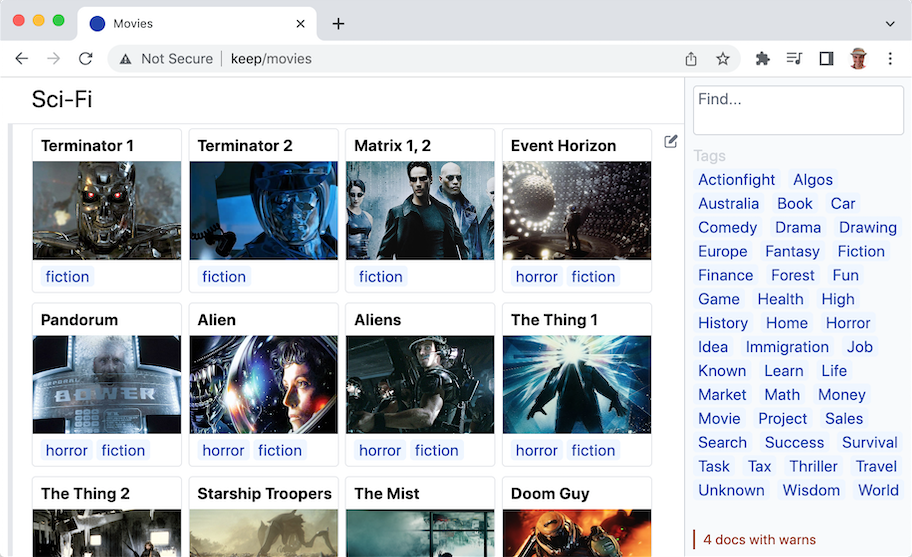
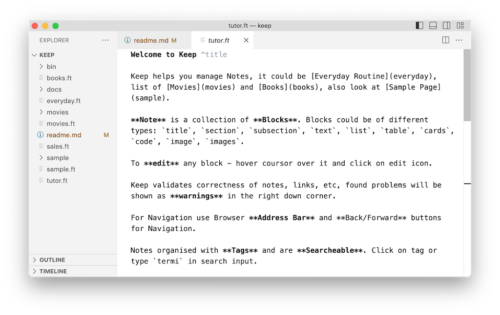

Keep helps you manage Notes




# Features

**Note** is a collection of **Blocks**. Blocks could be of different types: `title`, `section`, `subsection`, `text`, `list`, `table`, `cards`, `code`, `image`, `images`.

To **edit** any block - hover coursor over it and click on **edit icon**.

Keep validates correctness of notes, links, etc, found problems shown as **warnings** in the right down corner.

For Navigation use Browser **Address Bar** and **Back/Forward** buttons for Navigation.

Notes organised with **Tags** and are **Searcheable**.

# Installation

Keep written in Nim language, assuming you already have Nim installed, install Keep:

```
nimble install https://github.com/al6x/nim?subdir=keep
```

Then download sample notes - this repo, and run Keep:

```
git clone https://github.com/al6x/keep
cd keep
nim r --experimental:overloadable_enums --threads:off bin/run_keep.nim
open http://localhost:8080
```

# Take back control of your Browser

It's convenient to use `/keep` instead of `http://localhost:8080` noncense. Below instruction how to do it for Mac OS.

Add `127.0.0.1         keep` line to `/etc/hosts`.

Forward 80 to 8080:

```
echo "
rdr pass inet proto tcp from any to any port 80 -> 127.0.0.1 port 8080
" | sudo pfctl -ef -
```

Disable

```
echo "
" | sudo pfctl -ef -
```

sudo pfctl -F all -f /etc/pf.conf

Show

```
sudo pfctl -s nat
```

# FormalText

Keep uses `ft`, **FormalText**. It's like plain text, with annotations that allows it to be more formal and parsed. FormalText document is a list of Blocks. There are couple of built-in blocks, custom blocks could be defined. It's similar to Markdown, but more extensible.

# FormalText in VSCode



Install 'Highlight' by 'Fabio Spampinato' extension, and then add following to VSCode `settings.json`

```JSON
  "highlight.regexes": {
    // tags
    "(#[a-zA-Zа-яА-Я]+[a-zA-Zа-яА-Я0-9]*)": {
      "filterFileRegex": ".*.ft$",
      "decorations": [
        { "color": "rgb(30, 64, 175)", "fontWeight": "normal" } // "textDecoration": "underline"
      ]
    },

    // title and section
    "([^\n]+?)(\\s*\\^title|\\s*\\^section)(\\s*\n|\\Z)": {
      "filterFileRegex": ".*.ft$",
      "decorations": [
        { "fontWeight": "bold" } // "textDecoration": "underline"
      ]
    },
    // Command
    "(\\s*)(\\^[a-z0-9]+\\s*)(\n|\\Z)": {
      "filterFileRegex": ".*.ft$",
      "decorations": [
        { "color": "#9CA3AF" }, { "color": "#9CA3AF" }
      ]
    },
    // Bold
    "(\\*\\*[a-zA-Z0-9\\s]+\\*\\*)": {
      "filterFileRegex": ".*.ft$",
      "decorations": [
        { "fontWeight": "bold" }
      ]
    }
  }
```

# Extensibility

**Data Formats**, Keep uses FormalText format, other formats, for example Markdown or RST could be added. More **Docs** and **Blocks** types could be defined. It's possible to define **Custom Pages** for individual docs and collections.